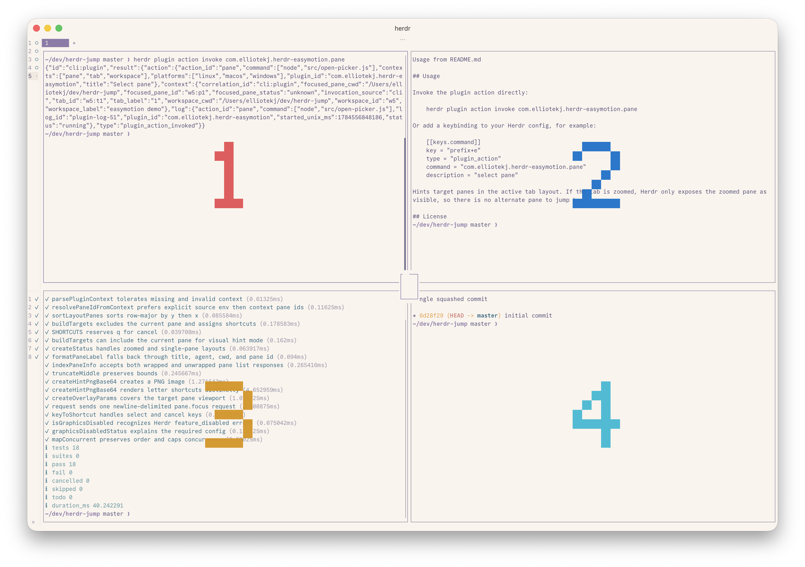

# Herdr EasyMotion

Jump directly between visible panes in the active [Herdr](https://github.com/ogulcancelik/herdr) tab with large numbered pane hints.

Herdr EasyMotion overlays each visible pane with a keyboard shortcut, then focuses the selected pane when you press the matching key. It is intended for layouts where directional pane movement is slower than selecting the destination directly.



## Installation

Install the plugin:

```bash
herdr plugin install elliotekj/herdr-easymotion
```

Pane hints use Herdr's experimental Kitty graphics support. Enable it in your Herdr config:

```toml
[experimental]
kitty_graphics = true
```

Reload or restart Herdr after changing the config.

## Usage

Invoke the plugin action directly:

```bash
herdr plugin action invoke com.elliotekj.herdr-easymotion.pane
```

Or add a keybinding to your Herdr config, for example:

```toml
[[keys.command]]
key = "prefix+e"
type = "plugin_action"
command = "com.elliotekj.herdr-easymotion.pane"
description = "select pane"
```

Hints target panes in the active tab layout. If the tab is zoomed, Herdr only exposes the zoomed pane as visible, so there is no alternate pane to jump to.

## License

[`Herdr EasyMotion`](LICENSE) is released under the Apache License 2.0.

## About

This plugin was written by Elliot Jackson.

* Blog: https://elliotekj.com
* Email: elliot@elliotekj.com
